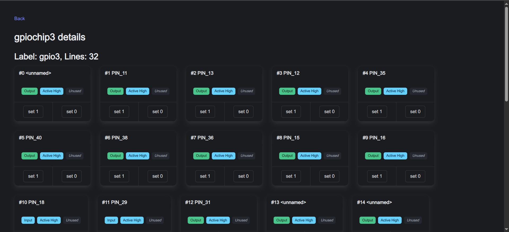

# node-libgpiod examples

Some samples of what you can do combining node ecosystem and sensors. All
samples bellow assumes that you did the
[environment setup](environment-configuration.md) correctly.

## Web Blinker

You can put a node server running a small page which offers a nice button to
make a led blink in no time:

```bash
mkdir web-blinker
cd web-blinker
npm init -y
npm i node-libgpiod
# use 'express@4' if node version on the SBC is too much old
npm i express
npm i alpinejs
touch index.js
mkdir public 
touch public/index.html
```

Define the html page and the script:

::: code-group

```html [index.html]
<!DOCTYPE html>
<html>

<head>
  <style>
    body {
      background-color: black;
      color: white;
      text-align: center;
      padding-top: 50px;
    }

    h1 {
      font-size: 48px;
    }

    p {
      font-size: 24px;
    }
  </style>
  <!-- alpine.js -->
  <script defer src="cdn.js"></script>
</head>

<body x-data="{ blinking: false }">
  <h1>Web Blinker</h1>
  <p>This is a simple web blinker application.</p>
  <button @click="blinking = !blinking ; fetch(`api/led/${blinking ? 'on' : 'off'}`)">
    Blink
    <span x-show="blinking">ON</span>
    <span x-show="!blinking">OFF</span>
  </button>

</html>
```

```javascript [index.js]
// index.js
const express = require('express');
const gpio = require('node-libgpiod');

const app = express();
const chip = new gpio.Chip(3);

app.use(express.static('public'));
app.use(express.static('node_modules/alpinejs/dist'));

app.get('/api/led/:state', (req, res) => {
  const { state } = req.params;
  console.log(`Received request to turn LED ${state}`);
  try {
    const v = state === 'on' ? 1 : 0;
    const led = chip.getLine(20);
    led.requestOutputMode();
    led.setValue(v);
    led.release();
    res.json({ status: `LED turned ${state}` });
  } catch (error) {
    console.error('Error controlling LED:', error);
    res.status(500).json({ error: 'Failed to control LED' });
  }
});

app.listen(3000, () => {
  console.log('Web Blinker app listening on port 3000');
});
```

:::

There, a simple web interface using [modern javascript](https://alpinejs.dev),
simple like that.

## Device ui

Another cool example is this web ui for all device details.

It's like `gpioinfo`, `gpioget` and `gpioset` but served over the network.

```bash
mkdir device-ui
cd device-ui
npm init -y
# use 'express@4' for older node versions
npm i express pug htmx.org bulma node-libgpiod
mkdir -p views/{layouts,pages,partials,components,controls}
touch index.js
touch views/layouts/base.pug
touch views/pages/index.pug
touch views/pages/chip.pug
touch views/partials/pin.pug
touch views/components/gpio-chip.pug
touch views/controls/pin-active-state.pug
touch views/controls/pin-consumer.pug
touch views/controls/pin-direction.pug
```

[Bulma][bulma] CSS framework provides a nice and modern look and feel,
[htmx][htmx] gives dynamic behavior in a declarative way and [pug][pug] eases
the creation of interface components.

[bulma]: https://bulma.io/
[htmx]: https://htmx.org/
[pug]: https://pugjs.org/api/getting-started.html

For example, this pug template renders the chip details page:

```pug
//- pages/chip.pug

extends ../layouts/base

include ../components/gpio-pin

block content
  .section
    a(href="/") Back
    h1= `${chip.name} details` 
    h2= `Label: ${chip.label}, Lines: ${chip.lines.length}`
    .is-flex.is-flex-wrap-wrap.is-gap-4
      each line in chip.lines
        .is-flex
          +gpio-pin(line)
    a(href="/") Back
```

The backend [express][express] handler providing the chip details follows:

[express]: https://expressjs.com/

```javascript
//...
app.get('/chip/:name', (req, res) => {
  const chip = new gpio.Chip(req.params.name)
  const lines = []
  for (let i = 0; i < chip.numberOfLines; i++) {
    const line = chip.getLine(i)
    lines.push({
      chipName: chip.name,
      offset: line.offset,
      name: line.name,
      value: line.value,
      consumer: line.consumer,
      direction: line.direction,
      activeState: line.activeState
    })
  }
  res.render('pages/chip', { 
    chip: { name: chip.name, label: chip.label, lines } 
  })
})
```

The resulting page looks like this:



Check out the [complete sample][deviceui]

[deviceui]: https://github.com/sombriks/node-libgpiod-examples/tree/main/device-ui

## Sensor message queue

## Further reading

Uou can check the old [examples](https://github.com/sombriks/node-libgpiod-examples)
